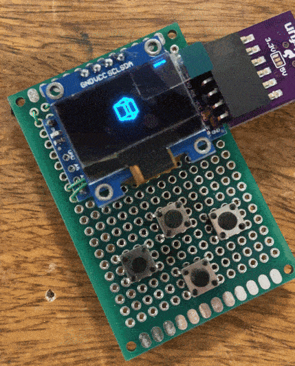

# Spinning Cube Arduino Pro Mini Project

  

## 🚀 [Try the Digital Simulation](https://wokwi.com/projects/394541744677321729)
<!-- Note: The simulation uses an Arduino UNO as Wokwi doesn't support the Pro Mini, but the actual project runs on a Pro Mini -->

## Overview

This project pushes the boundaries of microcontroller capabilities, combining creative coding, interaction design, and physical computing to render a captivating 3D spinning cube animation on a compact OLED display, all powered by an Arduino Pro Mini.

## Hardware

- **Arduino Pro Mini**: A tiny powerhouse running at 16 MHz
- **128x64 OLED Display**: Supports both I2C and SPI interfaces

## The Challenge

The Arduino Pro Mini, with its modest 16 MHz clock speed and mere 2 KB of SRAM, presents a formidable challenge for 3D graphics. This project demonstrates how to squeeze impressive visual performance out of limited hardware resources.

## Features

- 3D cube rotation around the Y-axis
- Dynamic cube size oscillation
- Perspective projection for a 3D effect
- Efficient code optimized for low-power microcontrollers

## Technical Insights

### Pushing the Limits
- Implements a basic 3D engine on a microcontroller with just 32 KB of flash memory
- Achieves smooth animations despite limited processing power
- Demonstrates efficient memory usage to prevent stack overflow

### 3D Graphics on a Tiny Chip
- Uses fixed-point arithmetic to avoid costly floating-point operations
- Implements optimized trigonometric functions
- Employs clever algorithms to reduce computation time

### Hardware Optimization
- Utilizes direct port manipulation for faster I/O operations
- Implements efficient display update routines to maximize frame rate

## Creative Coding and Interaction Possibilities

- Add potentiometers to control rotation speed or cube size
- Incorporate an accelerometer for motion-based interactions
- Expand with additional shapes or more complex 3D models (within memory constraints)

## Learning Opportunities

This project serves as an excellent case study for:
- Embedded systems programming
- Graphics programming on constrained hardware
- Optimization techniques for microcontrollers
- Creative coding within strict hardware limitations

## Future Explorations

- Implement more complex 3D models while maintaining performance
- Explore power optimization techniques for battery-powered operation
- Investigate ways to further push the limits of the Pro Mini's capabilities

Dive into the code to discover how mathematics, clever programming, and hardware knowledge combine to create this impressive display on such limited hardware. This project demonstrates the art of maximizing performance on minimal resources, a crucial skill in embedded systems and physical computing.